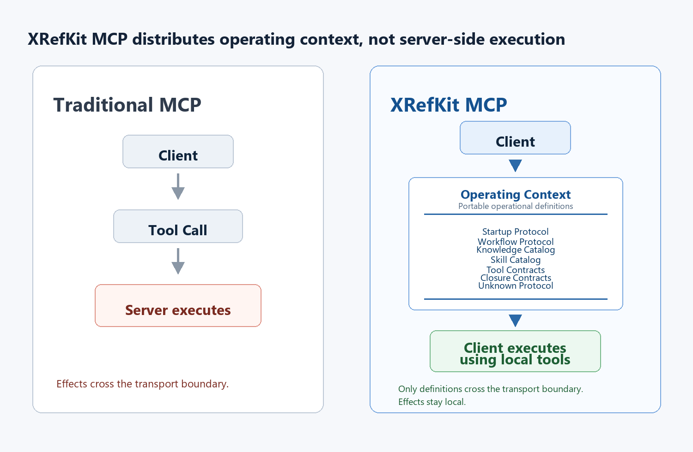

# XRefKit MCP



Traditional MCP transports execution. XRefKit MCP transports operational context.
Execution, side effects, and closure remain entirely on the client.

XRefKit MCP lets multiple humans and AI agents work against the same repository
governance rules, startup protocol, workflow order, Skill procedures, and
closure expectations over MCP.

It is a portability layer for XRefKit's operating model: a remote client can
load the rules it must follow without having the XRefKit repository checked out
locally.

## What It Solves

AI-assisted repository work often breaks down when every agent starts with a
different prompt, partial local memory, or a different interpretation of "done".
XRefKit MCP exposes the shared operational context that makes collaborative work
consistent:

- what must be read at startup
- which workflow applies
- which Skill procedure should be used
- which knowledge fragments are authoritative
- which tool contracts are available
- what must be true before closure

## What It Is Not

XRefKit MCP is not:

- a RAG server
- a Skill execution server
- an automation agent that mutates repositories
- a generic Git operation service
- an approval/apply service for canonical knowledge changes

The server sends inactive definitions and distributable client-side assets. Work,
tool execution, side effects, approval, and closure decisions stay on the client
side or with the responsible human.

## What It Distributes

The MCP server publishes:

- Knowledge: XID-addressed Markdown content and link resolution
- Workflow Protocol: workflow catalog and deterministic flow metadata
- Tool Contract: read-only MCP tool contracts plus client-side tool manifests
- Closure Contract: executor/checker/quality/handoff roles and closure rules
- Startup Protocol: base-control Markdown, load order, uncertainty policy, and
  context-direction guard
- Skill Content: `meta.md` and `SKILL.md` bodies with resolvable XID links
- Client Tools: versioned Python tools as files or a pip-installable package

The server sends read-only definitions and packages only:

- startup/base-control Markdown content
- workflow catalog entries from `flows/**/*.yaml`
- knowledge catalog entries from `knowledge/**/*.md`
- Skill metadata and `SKILL.md` content from `skills/**`
- distributable Python tool files from `tools/**/*.py` for client-side execution
- read-only tool contracts for catalog, expansion, and routing tools

It does not execute Skills, mutate repositories, approve knowledge updates, or
run arbitrary Git commands.

## Install

```powershell
cd C:\dev\itsm\XRefkit.MCP
python -m pip install -e ".[mcp]"
```

## Run An HTTPS Server For Claude

Claude custom connectors need a remote MCP endpoint that Claude can reach. Use
Streamable HTTP over HTTPS with a public DNS name and a certificate issued by a
publicly trusted CA. A self-signed certificate is suitable for local testing
only; Claude cannot use a loopback, private-LAN, or otherwise unreachable URL.

Provide the PEM certificate chain and matching private key directly:

```powershell
xrefkit-mcp-server `
  --repo C:\dev\itsm\XRefKit `
  --transport streamable-http `
  --host 0.0.0.0 `
  --port 443 `
  --ssl-certfile C:\certs\fullchain.pem `
  --ssl-keyfile C:\certs\privkey.pem
```

Then register this connector URL in Claude:

```text
https://mcp.example.com/mcp
```

Both TLS options are required together and are valid only with
`streamable-http`. For a conventional production URL without an explicit port,
terminate TLS on port 443 at a reverse proxy or gateway and forward requests to
the server's local HTTP endpoint.

HTTPS encrypts the connection but does not authenticate callers. This server is
read-only, but it exposes repository governance and Skill content. Do not
publish an authless endpoint containing confidential material; place it behind
an access-controlled gateway when authentication is required.

## Run A Development HTTP Server

Use `streamable-http` for clients connecting over the network.

```powershell
xrefkit-mcp-server `
  --repo C:\dev\itsm\XRefKit `
  --transport streamable-http `
  --host 0.0.0.0 `
  --port 8000
```

The client URL is:

```text
http://<server-host>:8000/mcp
```

Plain HTTP is intended for a trusted network or local development and is not a
Claude custom connector deployment URL.

Opening `/mcp` directly in a browser returns endpoint metadata only. MCP clients
must use Streamable HTTP requests with `Accept: application/json,
text/event-stream`; successful startup logs include `ListToolsRequest`.

For local-only testing, bind to loopback:

```powershell
xrefkit-mcp-server --repo C:\dev\itsm\XRefKit --transport streamable-http --host 127.0.0.1 --port 8000
```

`stdio` is still available for local clients:

```powershell
xrefkit-mcp-server --repo C:\dev\itsm\XRefKit
```

## Client Configuration

Client configuration syntax differs by MCP client, but the required values are:

```json
{
  "name": "xrefkit",
  "transport": "streamable-http",
  "url": "https://mcp.example.com/mcp"
}
```

If a client uses an `mcpServers` map, the equivalent shape is:

```json
{
  "mcpServers": {
    "xrefkit": {
      "transport": "streamable-http",
      "url": "https://mcp.example.com/mcp"
    }
  }
}
```

If your MCP client only supports stdio, run the server locally with stdio or use
that client's supported remote-MCP bridge. The XRefKit MCP endpoint itself is
the Streamable HTTP URL above.

## AI Client Instruction Template

Use the following as an `AGENTS.md` or equivalent global AI-client instruction
when the client is configured to use XRefKit MCP:

```markdown
# AGENTS.md Instructions

## Personal Codex Instruction

This user works with XRefKit-style repository governance.

At session start, if `xrefkit-mcp-server` is configured, call
`get_startup_context` first and treat the returned MCP access policy as
authoritative.

- If the MCP access policy says `mcp_only`, do not read XRefKit governance
  Markdown from a local checkout unless MCP is unavailable or the user explicitly
  disables MCP-only mode.
- Resolve XID-linked documents through the MCP resolver named in
  `get_startup_context`, normally `get_document_by_xid`.
- Use MCP catalog tools for workflows, Skills, knowledge entries, tool
  contracts, closure contracts, unknown protocol, and client-tool distribution
  when they are available.

If MCP is unavailable, follow the repository-defined loading process and treat
loaded AGENTS.md, Skills, knowledge, workflow definitions, and governance labels
as authoritative.

Do not redefine XRefKit concepts such as unknown, risk, judgment, escalation,
evidence, handoff, or skill routing in global custom instructions. Use the
repository definitions.

Global instructions should only control:

- concise communication
- progress visibility
- explicit summary of changes
- explicit list of unverified items
- respect for repository-defined stop-and-escalate rules

If a required rule is missing, do not invent a project rule. Mark it as missing
and suggest whether it belongs in AGENTS.md, a Skill, knowledge, or workflow
definition.
```

## Required Client Startup Flow

The client should call `get_startup_context` first.

That response contains:

- `access_policy`
- `client_instructions`
- `client_obligations`
- `link_resolution`
- base-control Markdown references, including full `content`
- workflow catalog entries
- executor/checker runtime role contract
- client-tool distribution metadata

The client must not assume the XRefKit repository exists on the client machine.
Use the transferred Markdown content and resolve any needed XID links through
MCP.

The startup response sets `access_policy.mode` to `mcp_only`. In this mode, the
client must treat XRefKit MCP as the source of truth for governance content:

- do not read XRefKit governance Markdown directly from the client filesystem
- do not resolve transferred Markdown links by filesystem path
- do not open local Skill files to bypass `get_skill`
- resolve XID links with `get_document_by_xid`

This is a client-side operating rule. If an AI client is also granted filesystem
access to the XRefKit repository, the server cannot technically prevent that
client from reading files. To enforce MCP-only access in VS Code or similar
clients, open a workspace that does not contain the XRefKit repository, or
disable/restrict filesystem tools for that repository, then connect to the MCP
server over `streamable-http`.

Link resolution rule:

Startup references are selected by stable XID, not by repository-relative
path. The `path` returned for each reference reports its current location and
may change when the source repository is reorganized; clients should identify
and cache startup documents by `xid`.

```json
{
  "link_field": "links",
  "xid_field": "xid",
  "resolver_tool": "get_document_by_xid",
  "resolver_argument": "xid",
  "example_call": "get_document_by_xid({\"xid\": \"8A666C1FD121\"})"
}
```

Every transferred Markdown link entry also repeats the resolver fields:

```json
{
  "xid": "5A1C8E4D2F90",
  "target": "017_base_and_xref_layering.md#xid-5A1C8E4D2F90",
  "path": "017_base_and_xref_layering.md",
  "resolver_tool": "get_document_by_xid",
  "resolver_argument": "xid"
}
```

## Client-Side XID Document Cache

Every XID-managed Markdown document uses its SHA-256 `content_hash` as an opaque
version token. Clients can keep validated document bodies locally and perform a
conditional MCP request:

The complete protocol and client boundary are documented in
[XID Document Client Cache](docs/xid-document-cache.md).

```json
{
  "xid": "8A666C1FD121",
  "known_version": "<cached-content-hash>"
}
```

When the version is unchanged and caching is cost-effective, the response has
`cache_status: "not_modified"` and omits `content`. A missing or stale version
returns the full current document. Calls that omit `known_version` retain the
previous full-response behavior.

For startup, pass all locally known versions in the first call:

```json
{
  "known_document_versions": {
    "8A666C1FD121": "<cached-content-hash>"
  }
}
```

Matching startup references retain routing metadata but set
`content_omitted: true`; the client must use its locally hash-validated body.

The package includes `XidDocumentCache`, which stores one JSON entry per XID,
validates content hashes, removes corrupt entries, writes updates atomically,
and exposes `known_versions()` for startup negotiation:

`get_repository_identity` is a content-free cache namespace preflight.
`get_startup_context` remains the first governance-content load.

```python
from pathlib import Path

from xrefkit_mcp import XidDocumentCache

identity_result = await session.call_tool("get_repository_identity", {})
repository_fingerprint = identity_result.structuredContent[
    "repository_fingerprint"
]
cache = XidDocumentCache(
    Path.home() / ".cache" / "xrefkit-mcp",
    repository_fingerprint,
)


async def fetch_document(xid: str, known_version: str | None) -> dict:
    result = await session.call_tool(
        "get_document_by_xid",
        {"xid": xid, "known_version": known_version},
    )
    return result.structuredContent


document = await cache.resolve("8A666C1FD121", fetch_document)


async def fetch_startup(known_versions: dict[str, str]) -> dict:
    result = await session.call_tool(
        "get_startup_context",
        {"known_document_versions": known_versions},
    )
    return result.structuredContent


startup = await cache.resolve_startup(fetch_startup)
```

Caching is enabled per document only when the estimated conditional-version
application payload is less than 50% of the full document payload. If the two
costs are comparable, `cache_policy.cache_recommended` is false and the helper
does not persist the document. The measurement excludes the fixed MCP envelope
and reports both byte counts in the full document response.

Do not send every cached version to every tool. `resolve_startup()` persists the
previous startup XID set and sends only those versions. For other calls, use
`known_versions(xids)` with only the documents required by that operation.

On the current XRefKit repository snapshot, 294 of 301 XID documents pass the
per-document cost gate; seven small documents bypass caching. The implemented
conditional request/response exchanges total 155,183 bytes versus 1,592,578
bytes for the equivalent full responses, or 9.74%. A cached startup request and
response total 31,122 bytes versus 59,219 bytes on first load, a 47.45%
reduction.

To inspect a Skill when the client has no local Skill files, call `get_skill`.
The response includes:

- `meta_content`
- `meta_links`
- `skill_content`
- `skill_links`

Resolve `meta_links[]` and `skill_links[]` the same way: call
`get_document_by_xid` with the link `xid`.

Cache-aware clients pass `known_document_versions` to `get_skill`. In that
mode, `meta_content` and `skill_content` are `null` and `documents[]` contains
the full or conditional XID document responses; pass each through
`XidDocumentCache.materialize()`. Use `list_skills(include_content=false)` when
only catalog metadata is needed; its `document_versions[]` identifies the two
XIDs to pass to `known_versions(xids)`.

## Client-Side Python Tools

Python code under XRefKit `tools/` is distributed for client-side execution. The
server never runs these tools.

Startup includes `client_tool_distribution`, a manifest with file paths, hashes,
run hints, package version, and resolver information. During client
initialization, call `check_client_tool_versions` with the installed package
versions and install/update the client tools when the check fails.

The client-tool model assumes the client obtains XRefKit deterministic tools
from this MCP server. A local XRefKit checkout is useful for development, but it
is not required by the portable client contract. The server distributes tool
files or a pip-installable package; the client materializes or installs them and
runs them in the client-side execution environment.

`client_tool_distribution` includes:

- `required_package_ids`
- `package_versions`
- `file_hash_algorithm`
- `version_check_tool`
- `materialization`
- `update_policy`
- `files[]`
- `instructions[]`

Example version check:

```json
{
  "installed": {
    "xrefkit-client-python-tools": "0.1.0",
    "xrefkit-client-tools": "0.1.0"
  }
}
```

To install the tools on a client that does not have the XRefKit checkout:

1. Call `get_client_tool_manifest` to inspect available files.
2. Call `get_client_tool_bundle` to fetch all distributable files, or
   `get_client_tool_file({"path": "tools/cs_scope_probe.py"})` for one file.
3. Write each returned file to the same relative path under the client-side
   target repository root.
4. Run tools on the client side, for example `python tools/cs_scope_probe.py`.

Alternatively, fetch a pip-installable source package with
`get_client_tool_pip_package`. The response contains `filename`,
`install_command`, `content_base64`, `content_hash`, and `warnings`. Write
`content_base64` to `filename`, then install it:

```powershell
python -m pip install xrefkit-client-tools-0.1.0.zip
```

The package preserves the top-level `tools` package because some scripts import
siblings such as `tools.error_policy_locator`. Install it in a project virtual
environment to avoid conflicts with unrelated packages named `tools`.

The distribution currently includes:

- `tools/**/*.py`
- support files under `tools/profiles/`
- `tools/README.md`

The C# `tools/structure_graph/` project is not bundled by the Python tool
distribution. Python tools that consume `structure_graph` output still expect
that output to be produced separately on the client side.

## Response Envelope Note

MCP clients may expose list-returning tools as `structuredContent.result`
because the MCP transport wraps bare arrays. `list_tool_contracts` identifies
those tools with:

```json
{
  "response_envelope": "mcp_result_array"
}
```

Object-returning tools use:

```json
{
  "response_envelope": "direct_object"
}
```

Tool contracts also include JSON Schema-compatible `input_json_schema` and
`output_json_schema` fields for client validation and binding generation. The
older compact `input_schema` and `output_schema` fields remain for display and
backward compatibility.

## Useful CLI Checks

```powershell
xrefkit-mcp-catalog startup-context --repo C:\dev\itsm\XRefKit
xrefkit-mcp-catalog list-workflows --repo C:\dev\itsm\XRefKit
xrefkit-mcp-catalog get-document --repo C:\dev\itsm\XRefKit --xid 8A666C1FD121
xrefkit-mcp-catalog get-document --repo C:\dev\itsm\XRefKit --xid 8A666C1FD121 --known-version <cached-content-hash>
xrefkit-mcp-catalog get-skill --repo C:\dev\itsm\XRefKit --skill-id csharp_review
xrefkit-mcp-catalog client-tool-manifest --repo C:\dev\itsm\XRefKit
xrefkit-mcp-catalog get-client-tool-file --repo C:\dev\itsm\XRefKit --path tools/cs_scope_probe.py
xrefkit-mcp-catalog client-tool-bundle --repo C:\dev\itsm\XRefKit
xrefkit-mcp-catalog client-tool-pip-package --repo C:\dev\itsm\XRefKit
xrefkit-mcp-catalog check-client-tool-versions --repo C:\dev\itsm\XRefKit --installed xrefkit-client-python-tools=0.1.0 --installed xrefkit-client-tools=0.1.0
xrefkit-mcp-catalog rank-skills --repo C:\dev\itsm\XRefKit --purpose "review C# code for non-Roslyn risks"
```

## Python Client Smoke Test

```python
import anyio
from mcp.client.session import ClientSession
from mcp.client.streamable_http import streamablehttp_client


async def main():
    async with streamablehttp_client("http://127.0.0.1:8000/mcp") as (read, write, _):
        async with ClientSession(read, write) as session:
            await session.initialize()
            startup = await session.call_tool("get_startup_context", {})
            context = startup.structuredContent

            first_link = context["references"][0]["links"][0]
            document = await session.call_tool(
                first_link["resolver_tool"],
                {first_link["resolver_argument"]: first_link["xid"]},
            )
            print(document.structuredContent["title"])


anyio.run(main)
```

## Security Notes

This server is read-only, but it can expose repository documentation and Skill
content over the network. Bind to `127.0.0.1` unless the network is trusted or a
reverse proxy / gateway provides authentication and transport security.

Do not expose `0.0.0.0:8000` directly to an untrusted network.

## Boundary

This package intentionally keeps the server plane read-only. Tool contracts
declare `execution_location` and `side_effects`; server-side tools are rejected
at definition time unless `side_effects` is `none`.
