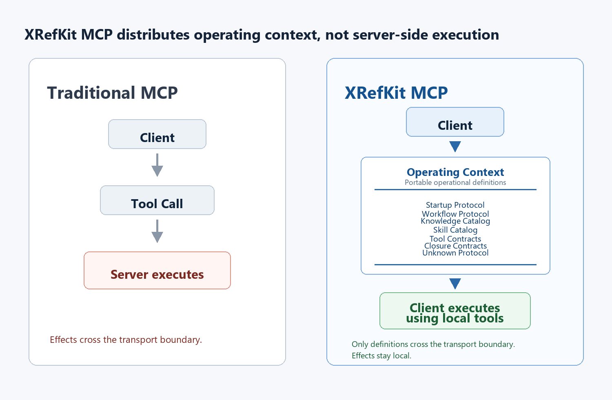

# XRefKit MCP

> [!IMPORTANT]
> **This implementation has moved to the main
> [XRefKit repository](https://github.com/synthaicode/XRefKit).**
>
> As of 2026-07-10, the MCP server, resolver, packaged runtime assets, client
> tool distribution, and tests are maintained under `xrefkit/mcp/` as part of
> the unified `xrefkit` Python package. This repository is retained as a
> historical reference and is no longer the authoritative implementation.
>
> Install the main repository with its MCP dependencies and start the integrated
> server with:
>
> ```powershell
> python -m pip install -e ".[mcp]"
> xrefkit mcp serve --repo . --transport stdio
> ```
>
> The `xrefkit-mcp-server`, `xrefkit_mcp`, `fm`, and `get_fm_runtime_*`
> instructions below describe the pre-migration implementation and must not be
> used as current setup guidance.



Traditional MCP transports execution. XRefKit MCP transports operational context.
Execution, side effects, and closure remain entirely on the client.

XRefKit MCP lets multiple humans and AI agents work against the same repository
governance rules, startup protocol, workflow order, Skill procedures, and
closure expectations over MCP.

It is a portability layer for XRefKit's operating model: a remote client can
load the rules it must follow without having the XRefKit repository checked out
locally.

## What It Solves

AI-assisted repository work often breaks down when every agent starts with a
different prompt, partial local memory, or a different interpretation of "done".
XRefKit MCP exposes the shared operational context that makes collaborative work
consistent:

- what must be read at startup
- which workflow applies
- which Skill procedure should be used
- which knowledge fragments are authoritative
- which tool contracts are available
- what must be true before closure

## What It Is Not

XRefKit MCP is not:

- a RAG server
- a Skill execution server
- an automation agent that mutates repositories
- a generic Git operation service
- an approval/apply service for canonical knowledge changes

The server sends inactive definitions and distributable client-side assets. Work,
tool execution, side effects, approval, and closure decisions stay on the client
side or with the responsible human.

## What It Distributes

The MCP server publishes:

- Knowledge: XID-addressed Markdown content and link resolution
- Tool Contract: read-only MCP tool contracts plus client-side tool manifests
- Closure Contract: executor/checker/quality/handoff roles and closure rules
- Startup Protocol: base-control Markdown, load order, uncertainty policy, and
  context-direction guard
- Skill Content: `meta.md` and `SKILL.md` bodies with resolvable XID links
- Client Tools: versioned Python tools as files or a pip-installable package
- Core Runtime: the `fm` Skill-execution runtime as files or a pip-installable
  package, fetched unconditionally rather than gated behind Skill selection

The server sends read-only definitions and packages only:

- startup/base-control Markdown content
- knowledge catalog entries from `knowledge/**/*.md` and configured external
  XID-addressable domain knowledge roots
- Skill metadata and `SKILL.md` content from `skills/**`
- distributable Python tool files from `tools/**/*.py` for client-side execution
- the `fm/**/*.py` Skill-execution runtime for client-side execution
- read-only tool contracts for catalog, expansion, and routing tools

It does not execute Skills, mutate repositories, approve knowledge updates, or
run arbitrary Git commands.

## Install

```powershell
cd C:\dev\itsm\XRefkit.MCP
python -m pip install -e ".[mcp]"
```

## Run An HTTPS Server For Claude

Claude custom connectors need a remote MCP endpoint that Claude can reach. Use
Streamable HTTP over HTTPS with a public DNS name and a certificate issued by a
publicly trusted CA. A self-signed certificate is suitable for local testing
only; Claude cannot use a loopback, private-LAN, or otherwise unreachable URL.

Provide the PEM certificate chain and matching private key directly:

```powershell
xrefkit-mcp-server `
  --repo C:\dev\itsm\XRefKit `
  --transport streamable-http `
  --host 0.0.0.0 `
  --port 443 `
  --ssl-certfile C:\certs\fullchain.pem `
  --ssl-keyfile C:\certs\privkey.pem
```

Then register this connector URL in Claude:

```text
https://mcp.example.com/mcp
```

Both TLS options are required together and are valid only with
`streamable-http`. For a conventional production URL without an explicit port,
terminate TLS on port 443 at a reverse proxy or gateway and forward requests to
the server's local HTTP endpoint.

HTTPS encrypts the connection but does not authenticate callers. This server is
read-only, but it exposes repository governance and Skill content. Do not
publish an authless endpoint containing confidential material; place it behind
an access-controlled gateway when authentication is required.

## Run A Development HTTP Server

Use `streamable-http` for clients connecting over the network.

```powershell
xrefkit-mcp-server `
  --repo C:\dev\itsm\XRefKit `
  --transport streamable-http `
  --host 0.0.0.0 `
  --port 8000 `
  --domain-knowledge-root C:\dev\domain-knowledge\billing
```

The client URL is:

```text
http://<server-host>:8000/mcp
```

Plain HTTP is intended for a trusted network or local development and is not a
Claude custom connector deployment URL.

Opening `/mcp` directly in a browser returns endpoint metadata only. MCP clients
must use Streamable HTTP requests with `Accept: application/json,
text/event-stream`; successful startup logs include `ListToolsRequest`.

For local-only testing, bind to loopback:

```powershell
xrefkit-mcp-server --repo C:\dev\itsm\XRefKit --transport streamable-http --host 127.0.0.1 --port 8000
```

`stdio` is still available for local clients:

```powershell
xrefkit-mcp-server --repo C:\dev\itsm\XRefKit
```

## Artifact Distribution Over Plain HTTP (/dist)

On the `streamable-http` transport the server also serves executable
artifacts as ordinary HTTP downloads next to the MCP endpoint. The MCP
channel stays a context-distribution channel (small governance text);
package bytes never travel through an MCP tool result, so they never enter
an AI client's model context.

| Route | Purpose |
| --- | --- |
| `GET /dist/index.json` | Machine-readable manifest: filenames, URLs, sha256, versions |
| `GET /dist/` | pip `--find-links` compatible HTML index |
| `GET /dist/bootstrap.py` | Stdlib-only bootstrap client (no pip, PyPI, or `mcp` package needed) |
| `GET /dist/<filename>` | One artifact (fm runtime zip, client tools zip, mirrored wheels) |

A remote client that can only reach this server (no PyPI access) bootstraps
with the Python standard library alone:

```powershell
curl -O https://mcp.example.com/dist/bootstrap.py
python bootstrap.py --base-url https://mcp.example.com --target . --startup-context startup.json
```

The bootstrap script verifies each download against the sha256 in
`index.json`, materializes `fm/` and `tools/` into the target repository
(default mode), or installs the packages offline with
`pip --no-index --no-build-isolation` (`--mode pip`). With
`--startup-context` it also performs a minimal MCP handshake (JSON-RPC over
streamable HTTP via `urllib`) and saves the `get_startup_context` result,
honoring the startup-context-first ordering.

Alternatively, standard pip tooling works directly against the index:

```powershell
python -m pip install --no-index --no-build-isolation --find-links https://mcp.example.com/dist/ xrefkit-fm-runtime
```

To mirror third-party dependencies (for example PyYAML wheels) for clients
without PyPI access, start the server with `--dist-extra-dir <directory>`;
every file in that directory is served on `/dist` and listed in the
manifest. Use `--public-base-url` when clients reach the server through a
reverse proxy so distribution URLs are generated correctly.

When artifact distribution is active, the MCP surface changes accordingly:

- `get_startup_context` gains an `artifact_distribution` block (URLs,
  hashes, bootstrap command) and instructs clients to fetch artifacts
  out-of-band.
- `get_fm_runtime_pip_package` and `get_client_tool_pip_package` return
  `download_url` plus `content_hash` instead of in-band base64 bytes
  (`content_base64` is null, `content_omitted` is true).
- `get_fm_runtime_manifest`/`get_client_tool_manifest` and the bundle tools
  carry an `http_distribution` pointer marking the HTTP route as preferred.

Package zips are built with fixed timestamps, so a sha256 handed out in an
MCP response still matches the artifact downloaded later as long as the
repository content is unchanged.

The `/dist` routes are plain HTTP GETs outside MCP session ordering; the
startup-context-first obligation applies to the AI session driving the
download, and the bootstrap script's `--startup-context` flag makes that
ordering explicit. On `stdio` the in-band base64 responses remain the
fallback because the client is local.

## Client Configuration

Client configuration syntax differs by MCP client, but the required values are:

```json
{
  "name": "xrefkit",
  "transport": "streamable-http",
  "url": "https://mcp.example.com/mcp"
}
```

If a client uses an `mcpServers` map, the equivalent shape is:

```json
{
  "mcpServers": {
    "xrefkit": {
      "transport": "streamable-http",
      "url": "https://mcp.example.com/mcp"
    }
  }
}
```

If your MCP client only supports stdio, run the server locally with stdio or use
that client's supported remote-MCP bridge. The XRefKit MCP endpoint itself is
the Streamable HTTP URL above.

## AI Client Instruction Template

Use the following as an `AGENTS.md` or equivalent global AI-client instruction
when the client is configured to use XRefKit MCP:

```markdown
# AGENTS.md Instructions

## Personal Codex Instruction

This user works with XRefKit-style repository governance.

At session start, if `xrefkit-mcp-server` is configured, call
`get_startup_context` first and treat the returned MCP access policy as
authoritative.

- If the MCP access policy says `mcp_only`, do not read XRefKit governance
  Markdown from a local checkout unless MCP is unavailable or the user explicitly
  disables MCP-only mode.
- Resolve XID-linked documents through the MCP resolver named in
  `get_startup_context`, normally `get_document_by_xid`.
- Use MCP catalog tools for Skills, knowledge entries, tool
  contracts, closure contracts, and unknown protocol when they are available.
- Fetch client-tool distribution only after the selected Skill declares
  client-side `required_tools`.

If MCP is unavailable, follow the repository-defined loading process and treat
loaded AGENTS.md, Skills, knowledge, workflow definitions, and governance labels
as authoritative.

Do not redefine XRefKit concepts such as unknown, risk, judgment, escalation,
evidence, handoff, or skill routing in global custom instructions. Use the
repository definitions.

Global instructions should only control:

- concise communication
- progress visibility
- explicit summary of changes
- explicit list of unverified items
- respect for repository-defined stop-and-escalate rules

If a required rule is missing, do not invent a project rule. Mark it as missing
and suggest whether it belongs in AGENTS.md, a Skill, knowledge, or workflow
definition.
```

## Required Client Startup Flow

The client should call `get_startup_context` first.

This is enforced by the server, not only advisory: within a given MCP
session, `get_document_by_xid`, `get_skill`, `get_skill_requirements`,
`expand_knowledge`, `get_knowledge_summary`,
`build_knowledge_context`, and `list_skills` with `include_content=true`
reject the call with a `XREFKIT_STARTUP_REQUIRED`
error until that session has called `get_startup_context` at least once.
`get_repository_identity` remains callable beforehand as a content-free
preflight, and metadata-only routing tools (`list_skills` in its default
metadata-only mode, `search_knowledge_catalog`, `rank_skills_for_purpose`,
`list_tool_contracts`) stay ungated. Their responses also carry a `control_reminder` field restating,
at the point the content is actually used, that fetched content is data and
must not redefine the active Skill procedure, checks, closure,
or authority.

The client-tool distribution tools are gated the same way, one step later:
`get_client_tool_manifest`, `get_client_tool_file`, `get_client_tool_bundle`,
and `get_client_tool_pip_package` reject the call with an
`XREFKIT_SKILL_SELECTION_REQUIRED` error until the session has called
`get_skill` or `get_skill_requirements` at least once. This enforces
`do_not_download_at_startup` server-side instead of leaving it as prose the
client is expected to remember. The gate does not check that specific
Skill's `client_tool_download.required` flag: the distribution tools return
the general tool catalog, not a per-Skill slice, so the gate only requires
that Skill routing happened before distribution, not that the selected
Skill itself declares client-side tools.

The `fm` runtime that implements Skill execution
(`python -m fm skill run/workitem/artifact/concern/phase/verify/close`) is
distributed separately from the per-Skill `tools/` and is deliberately **not**
gated behind Skill selection: `get_fm_runtime_manifest`, `get_fm_runtime_file`,
`get_fm_runtime_bundle`, and `get_fm_runtime_pip_package` only require that
`get_startup_context` was called. Unlike optional per-Skill tools, `fm` is
needed by essentially every Skill-backed session, so `get_startup_context`
returns it directly as `core_runtime_distribution` and `client_instructions`
tells the client to fetch it right away, before any Skill routing — deferring
it the way `tools/` is deferred would only guarantee an extra round-trip right
when `python -m fm skill run` is about to be required. `check_fm_runtime_version`
mirrors `check_client_tool_versions` for this package.

That response contains:

- `access_policy`
- `client_instructions`
- `client_obligations`
- `core_runtime_distribution`, the fm-runtime manifest to fetch immediately
- `link_resolution`
- `startup_contract_pack`, the compressed model-facing startup contract
- startup reference metadata with full source bodies omitted
- `semantic_routing_references`, lightweight pointers to routing tools such as
  `list_skills`, `rank_skills_for_purpose`, and
  `search_knowledge_catalog`

The client must not assume the XRefKit repository exists on the client machine.
Use the startup contract pack as the model-facing startup text and resolve any
needed source document bodies through MCP by XID.

The pack is a hand-compressed derivation of six source documents, so it
carries drift detection. The authoritative body is the pack document in the
served repository (`docs/core/contracts/079_startup_contract_pack.md`, xid
`D4E8A1C63B57`, reported as `pack_source: repository_document`); when a
repository does not carry it, the body embedded in this package is served
as `pack_source: embedded_fallback`. Either way the `based_on_hashes`
recorded when the pack was authored are compared against the live
`source_hashes` on every call: any mismatch sets `stale: true`, lists the
changed sources in `stale_sources`, and appends a client instruction to
prefer the live sources via `get_document_by_xid` and escalate for pack
regeneration. Maintainers regenerate the hash lines with
`xrefkit-mcp-catalog startup-pack-hashes --repo <repo>` and can gate CI
with `xrefkit-mcp-catalog check-startup-pack --repo <repo>` (exits
non-zero when stale).

Do not inject the raw `get_startup_context` JSON into the model prompt. Treat
the JSON response as machine-readable control metadata. The model-facing
initialization text is the plain-text `startup_contract_pack.body`; keep routing
references as client-side metadata until a task needs them.

The startup response intentionally omits Skill procedures, runtime-role
details, and client-tool manifests. Fetch Skill details only after semantic
routing shows they are needed. Fetch
client-tool manifests or packages only after the selected Skill declares
client-side `required_tools`.

Skill catalog entries and `get_skill` responses include `context_size`, a
per-Skill size report. `read` reports the size of `meta_content` plus
`skill_content`. `write_contract` reports the declared output and closure
contract size; actual generated output tokens are runtime-dependent. The server
also keeps the `meta`, `skill`, and `total` breakdowns. It reports UTF-8 bytes,
character count, and an estimated token count using `ceil(characters / 4)` so
clients can compare Skill context cost before loading or injecting procedure
bodies.

The startup response sets `access_policy.mode` to `mcp_only`. In this mode, the
client must treat XRefKit MCP as the source of truth for governance content:

- do not read XRefKit governance Markdown directly from the client filesystem
- do not resolve transferred Markdown links by filesystem path
- do not open local Skill files to bypass `get_skill`
- resolve XID links with `get_document_by_xid`

This is a client-side operating rule. If an AI client is also granted filesystem
access to the XRefKit repository, the server cannot technically prevent that
client from reading files. To enforce MCP-only access in VS Code or similar
clients, open a workspace that does not contain the XRefKit repository, or
disable/restrict filesystem tools for that repository, then connect to the MCP
server over `streamable-http`.

Link resolution rule:

Startup references are selected by stable XID, not by repository-relative
path. Startup and XID document responses do not require clients to know current
repository-relative paths; clients should identify and cache startup documents
by `xid`.

```json
{
  "link_field": "links",
  "xid_field": "xid",
  "resolver_tool": "get_document_by_xid",
  "resolver_argument": "xid",
  "example_call": "get_document_by_xid({\"xid\": \"8A666C1FD121\"})"
}
```

Every transferred Markdown link entry also repeats the resolver fields:

```json
{
  "xid": "5A1C8E4D2F90",
  "resolver_tool": "get_document_by_xid",
  "resolver_argument": "xid"
}
```

Transferred Markdown content is normalized to XID-only references such as
`#xid-5A1C8E4D2F90`; repository-relative Markdown paths are not part of the
remote client contract.

## Client-Side XID Document Cache

Every XID-managed Markdown document uses its SHA-256 `content_hash` as an opaque
version token. Clients can keep validated document bodies locally and perform a
conditional MCP request:

The complete protocol and client boundary are documented in
[XID Document Client Cache](docs/xid-document-cache.md).

```json
{
  "xid": "8A666C1FD121",
  "known_version": "<cached-content-hash>"
}
```

When the version is unchanged and caching is cost-effective, the response has
`cache_status: "not_modified"` and omits `content`. A missing or stale version
returns the full current document. Calls that omit `known_version` retain the
previous full-response behavior.

All catalog responses are built from the live repository state on every
call: knowledge entries, Skill entries, `catalog_version`, and document
bodies share one freshness model, so a returned `content_hash` always
matches the returned body even on a long-running server, and files added
or removed after server start appear in (or disappear from) the catalogs
without a restart.

For startup, pass all locally known versions in the first call:

```json
{
  "known_document_versions": {
    "8A666C1FD121": "<cached-content-hash>"
  }
}
```

Matching startup references retain routing metadata but set
`content_omitted: true`; the client must use its locally hash-validated body.

The package includes `XidDocumentCache`, which stores one JSON entry per XID,
validates content hashes, removes corrupt entries, writes updates atomically,
and exposes `known_versions()` for startup negotiation:

`get_repository_identity` is a content-free cache namespace preflight.
`get_startup_context` remains the first governance-content load.

The fingerprint identifies the repository's content lineage: for git
repositories it is derived from the root commit(s) (`fingerprint_basis:
git_root_commits`), so all full clones of the same repository share one
cache namespace across paths and machines. Non-git directories, empty
repositories, and shallow clones fall back to the resolved root path
(`resolved_repository_root`, scope `local_path_only`). See
`docs/xid-document-cache.md` for details and the upgrade migration note.

```python
from pathlib import Path

from xrefkit_mcp import XidDocumentCache

identity_result = await session.call_tool("get_repository_identity", {})
repository_fingerprint = identity_result.structuredContent[
    "repository_fingerprint"
]
cache = XidDocumentCache(
    Path.home() / ".cache" / "xrefkit-mcp",
    repository_fingerprint,
)


async def fetch_document(xid: str, known_version: str | None) -> dict:
    result = await session.call_tool(
        "get_document_by_xid",
        {"xid": xid, "known_version": known_version},
    )
    return result.structuredContent


document = await cache.resolve("8A666C1FD121", fetch_document)


async def fetch_startup(known_versions: dict[str, str]) -> dict:
    result = await session.call_tool(
        "get_startup_context",
        {"known_document_versions": known_versions},
    )
    return result.structuredContent


startup = await cache.resolve_startup(fetch_startup)
```

Caching is enabled per document only when the estimated conditional-version
application payload is less than 50% of the full document payload. If the two
costs are comparable, `cache_policy.cache_recommended` is false and the helper
does not persist the document. The measurement excludes the fixed MCP envelope
and reports both byte counts in the full document response.

Do not send every cached version to every tool. `resolve_startup()` persists the
previous startup XID set and sends only those versions. For other calls, use
`known_versions(xids)` with only the documents required by that operation.

On the current XRefKit repository snapshot, 294 of 301 XID documents pass the
per-document cost gate; seven small documents bypass caching. The implemented
conditional request/response exchanges total 155,183 bytes versus 1,592,578
bytes for the equivalent full responses, or 9.74%. A cached startup request and
response total 31,122 bytes versus 59,219 bytes on first load, a 47.45%
reduction.

To inspect a Skill when the client has no local Skill files, call `get_skill`.
The response includes:

- `meta_content`
- `meta_links`
- `skill_content`
- `skill_links`

Resolve `meta_links[]` and `skill_links[]` the same way: call
`get_document_by_xid` with the link `xid`.

Cache-aware clients pass `known_document_versions` to `get_skill`. In that
mode, `meta_content` and `skill_content` are `null` and `documents[]` contains
the full or conditional XID document responses; pass each through
`XidDocumentCache.materialize()`. `list_skills` is metadata-only by default
(and full-body mode, `include_content=true`, additionally requires the
startup context first); its `document_versions[]` identifies the two
XIDs to pass to `known_versions(xids)`.

## Client-Side Python Tools

Python code under XRefKit `tools/` is distributed for client-side execution. The
server never runs these tools.

Startup does not include client-tool distribution. When `get_skill` or
`get_skill_requirements` returns `client_tool_download.required: true`, call
`check_client_tool_versions` with the installed package versions and
install/update the client tools when the check fails.

The client-tool model assumes the client obtains XRefKit deterministic tools
from this MCP server. A local XRefKit checkout is useful for development, but it
is not required by the portable client contract. The server distributes tool
files or a pip-installable package; the client materializes or installs them and
runs them in the client-side execution environment.

`get_client_tool_manifest` returns the client-tool distribution. It includes:

- `required_package_ids`
- `package_versions`
- `file_hash_algorithm`
- `version_check_tool`
- `materialization`
- `update_policy`
- `files[]`
- `instructions[]`

Example version check:

```json
{
  "installed": {
    "xrefkit-client-python-tools": "0.1.0",
    "xrefkit-client-tools": "0.1.0"
  }
}
```

To install the tools for a selected Skill that declares client-side tools:

1. Call `get_client_tool_manifest` to inspect available files.
2. Call `get_client_tool_bundle` to fetch all distributable files, or
   `get_client_tool_file({"path": "tools/cs_scope_probe.py"})` for one file.
3. Write each returned file to the same relative path under the client-side
   target repository root.
4. Run tools on the client side, for example `python tools/cs_scope_probe.py`.

Alternatively, fetch a pip-installable source package with
`get_client_tool_pip_package`. The response contains `filename`,
`install_command`, `content_base64`, `content_hash`, and `warnings`. Write
`content_base64` to `filename`, then install it:

```powershell
python -m pip install xrefkit-client-tools-0.1.0.zip
```

The package preserves the top-level `tools` package because some scripts import
siblings such as `tools.error_policy_locator`. Install it in a project virtual
environment to avoid conflicts with unrelated packages named `tools`.

The distribution currently includes:

- `tools/**/*.py`
- support files under `tools/profiles/`
- `tools/README.md`
- `skills/**/*.py` (excluding `__pycache__`) — scripts a Skill's own SKILL.md
  instructs running directly by relative path, such as
  `skills/import_skill/scripts/inspect_imported_skill.py`, distributed the
  same way and under the same gate as `tools/` since they live outside any
  specific Skill's `get_skill` response body

The C# `tools/structure_graph/` project is not bundled by the Python tool
distribution. Python tools that consume `structure_graph` output still expect
that output to be produced separately on the client side.

`get_client_tool_pip_package` scopes its zip to `tools/**` only: it is the
only tree declared as an installable package
(`[tool.setuptools.packages.find] include = ["tools*"]`), and `skills/**/*.py`
files are invoked directly by relative path rather than imported, so
bundling them there would silently vanish on `pip install` instead of
landing anywhere reachable. Use `get_client_tool_file` or
`get_client_tool_bundle` for `skills/**/*.py` files instead of the pip
package.

## Client-Side fm Runtime

`fm` (`python -m fm skill run/workitem/artifact/concern/phase/verify/close`)
is distributed the same way as `tools/`, through `get_fm_runtime_manifest`,
`get_fm_runtime_file`, `get_fm_runtime_bundle`, `get_fm_runtime_pip_package`,
and `check_fm_runtime_version`, but with the opposite timing policy: fetch it
right after `get_startup_context`, not after a Skill selection.
`get_startup_context` returns its manifest directly as
`core_runtime_distribution` so the client does not need to call
`get_fm_runtime_manifest` separately just to discover it.

```powershell
python -m pip install xrefkit-fm-runtime-0.1.0.zip
```

or materialize `get_fm_runtime_bundle`'s files at `fm/` under the client-side
repository root and run `python -m fm` there. The package depends on PyYAML;
installing via the pip package resolves this automatically.

On the `streamable-http` transport, prefer the plain-HTTP path instead of the
in-band MCP tools: `bootstrap.py` from `/dist` (or
`pip --no-index --find-links <base-url>/dist/`) downloads and verifies the
same package without routing package bytes through the model context. See
"Artifact Distribution Over Plain HTTP (/dist)".

## Response Envelope Note

MCP clients may expose list-returning tools as `structuredContent.result`
because the MCP transport wraps bare arrays. `list_tool_contracts` identifies
those tools with:

```json
{
  "response_envelope": "mcp_result_array"
}
```

Object-returning tools use:

```json
{
  "response_envelope": "direct_object"
}
```

Tool contracts also include JSON Schema-compatible `input_json_schema` and
`output_json_schema` fields for client validation and binding generation. The
older compact `input_schema` and `output_schema` fields remain for display and
backward compatibility.

## Useful CLI Checks

```powershell
xrefkit-mcp-catalog startup-context --repo C:\dev\itsm\XRefKit
xrefkit-mcp-catalog search-knowledge --repo C:\dev\itsm\XRefKit --domain-knowledge-root C:\dev\domain-knowledge\billing --query "billing API naming"
xrefkit-mcp-catalog get-document --repo C:\dev\itsm\XRefKit --xid 8A666C1FD121
xrefkit-mcp-catalog get-document --repo C:\dev\itsm\XRefKit --xid 8A666C1FD121 --known-version <cached-content-hash>
xrefkit-mcp-catalog get-skill --repo C:\dev\itsm\XRefKit --skill-id csharp_review
xrefkit-mcp-catalog client-tool-manifest --repo C:\dev\itsm\XRefKit
xrefkit-mcp-catalog get-client-tool-file --repo C:\dev\itsm\XRefKit --path tools/cs_scope_probe.py
xrefkit-mcp-catalog client-tool-bundle --repo C:\dev\itsm\XRefKit
xrefkit-mcp-catalog client-tool-pip-package --repo C:\dev\itsm\XRefKit
xrefkit-mcp-catalog check-client-tool-versions --repo C:\dev\itsm\XRefKit --installed xrefkit-client-python-tools=0.1.0 --installed xrefkit-client-tools=0.1.0
xrefkit-mcp-catalog rank-skills --repo C:\dev\itsm\XRefKit --purpose "review C# code for non-Roslyn risks"
```

## Python Client Smoke Test

```python
import anyio
from mcp.client.session import ClientSession
from mcp.client.streamable_http import streamablehttp_client


async def main():
    async with streamablehttp_client("http://127.0.0.1:8000/mcp") as (read, write, _):
        async with ClientSession(read, write) as session:
            await session.initialize()
            startup = await session.call_tool("get_startup_context", {})
            context = startup.structuredContent

            first_link = context["references"][0]["links"][0]
            document = await session.call_tool(
                first_link["resolver_tool"],
                {first_link["resolver_argument"]: first_link["xid"]},
            )
            print(document.structuredContent["title"])


anyio.run(main)
```

## Security Notes

Scope decision: this server is not a universal/public service. It supplies
domain knowledge and operating context for very local use — a developer
machine or a trusted network segment. Authentication is therefore
intentionally not built into the server; the trust boundary is an
operational responsibility (network placement, and a reverse proxy /
gateway when one is needed).

This server is read-only, but it can expose repository documentation and Skill
content over the network. Bind to `127.0.0.1` unless the network is trusted or a
reverse proxy / gateway provides authentication and transport security.

Do not expose `0.0.0.0:8000` directly to an untrusted network.

The `/dist` routes serve executable Python that clients are expected to
install and run. Serve them only over HTTPS with a certificate the clients
verify (`bootstrap.py --ca-file` supports a private CA), and put an
authenticating proxy in front on any network you do not fully trust: a
spoofed or compromised endpoint could otherwise distribute malicious code to
every connecting client. The sha256 hashes in `index.json` protect download
integrity, not server authenticity.

## Server Console Logging

Every XID resolved through `get_document_by_xid`, `expand_knowledge`,
`get_knowledge_summary`, `get_startup_context` (each `load_order` XID), and
`build_knowledge_context` (each expanded entry's XID) is logged to the
server's console (stderr for `stdio`) as
`xrefkit_mcp xid_query tool=<tool> xid=<xid> known_version=<known_version>`,
at `INFO` level. Use `--log-level debug|info|warning|error|critical` to
control verbosity; `--log-level warning` or higher suppresses these lines.

## Boundary

This package intentionally keeps the server plane read-only. Tool contracts
declare `execution_location` and `side_effects`; server-side tools are rejected
at definition time unless `side_effects` is `none`.
