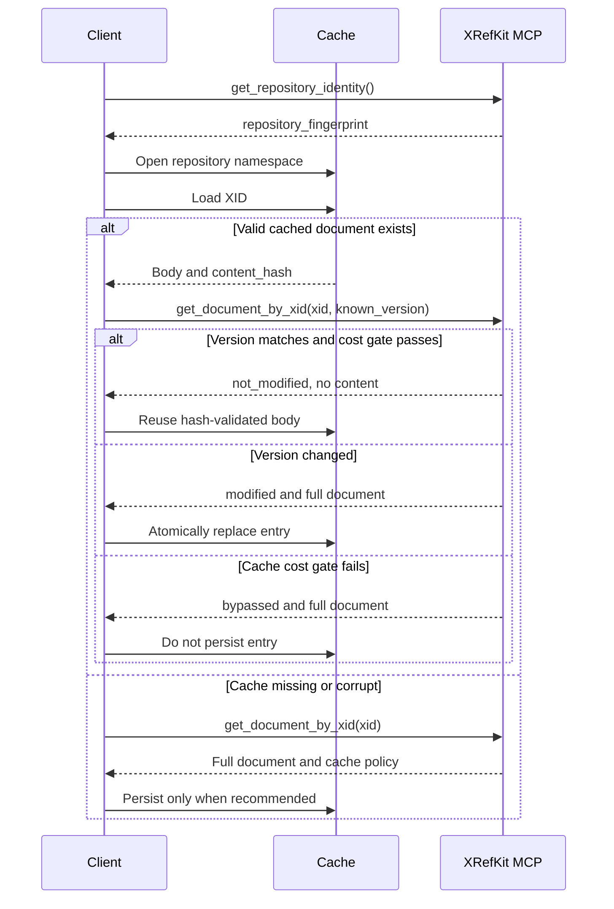

# XID Document Client Cache

## Purpose

This document defines the client-side cache and conditional retrieval protocol
for Markdown documents managed by XRefKit XIDs.

The goals are:

- keep reusable XID document bodies on the client
- perform a version check before every reuse
- omit the document body from the MCP response when the cached version is current
- fetch and replace the cached body when the version changes
- bypass caching when version negotiation costs about as much as loading the body

The server remains the source of truth. The cache is only a validated local copy.

## Scope

The cache applies only to documents with an XID. Documents represented by a
fallback `path:` identifier are not cacheable.

Cache identity is scoped to one repository fingerprint. An XID is not assumed
to be globally unique across repositories.

The current cache-aware surfaces are:

- `get_document_by_xid`
- startup references returned by `get_startup_context`
- Skill `meta.md` and `SKILL.md` documents returned by cache-aware `get_skill`
- metadata-only Skill catalog reads through `list_skills(include_content=false)`

## Version Model

The version token is the SHA-256 `content_hash` of the UTF-8 document body.

The XRefKit source documents do not contain an explicit version field. A version
is derived by XRefKit MCP when the repository is loaded:

```text
version = SHA-256(document UTF-8 content)
```

Consequences:

- any body change creates a new version automatically
- unchanged content keeps the same version
- clients treat the version as an opaque string
- no manual version increment is required
- path or Git history changes do not alter the version unless the body changes

## Repository Cache Namespace

Before opening a cache, the client calls `get_repository_identity`. The server
returns:

```json
{
  "repository_fingerprint": "<32-hex-character-fingerprint>",
  "fingerprint_algorithm": "sha256",
  "fingerprint_basis": "resolved_repository_root",
  "cache_namespace": "<32-hex-character-fingerprint>"
}
```

This identity call is a content-free cache namespace preflight.
`get_startup_context` remains the first governance-content load and the
authoritative startup contract.

The client cache layout is:

```text
<cache-root>/<repository_fingerprint>/<XID>.json
```

The fingerprint is derived from the server's normalized, resolved repository
root. It prevents two repositories containing the same XID from sharing one
cache entry. Moving the repository creates a new namespace and a safe cache
miss.

Every cache entry also stores `repository_fingerprint`. Loading or materializing
an entry fails closed when the stored, response, and active namespace
fingerprints differ.

## Protocol Overview



## Conditional XID Retrieval

### Request

Call `get_document_by_xid` with the version stored with the local body:

```json
{
  "xid": "8A666C1FD121",
  "known_version": "<cached-content-hash>"
}
```

### Cache Hit

When the version matches and the cost gate permits caching:

```json
{
  "xid": "8A666C1FD121",
  "title": "Uncertainty Protocol",
  "path": "docs/016_uncertainty_protocol.md",
  "version": "<current-content-hash>",
  "content_hash": "<current-content-hash>",
  "cache_status": "not_modified",
  "content_omitted": true
}
```

The client must load the body from its local cache and validate that its
SHA-256 hash still equals `content_hash`.

When materializing `not_modified`, the client must use current metadata from the
server response and reuse only the cached body. `title`, `path`, and other
returned metadata must not be replaced by stale cached values.

### Cache Miss Or Stale Version

When no version is supplied, or the supplied version is stale, the response
contains the complete document and:

- `cache_status: "miss"` when no version was supplied
- `cache_status: "modified"` when the supplied version differs
- `content_omitted: false`
- `cache_policy` with the measured cost decision

### Cost Bypass

If the supplied version matches but the cost gate rejects caching, the server
returns the body with:

```json
{
  "cache_status": "bypassed",
  "content_omitted": false
}
```

The client must not persist that document.

`bypassed` is used only when a conditional request could otherwise return
`not_modified`, but the cost gate requires a full body. An uncached first load
remains `cache_status: "miss"` with
`cache_policy.cache_recommended: false`.

## Cost Gate

Caching is adopted per document only when:

```text
version_payload_bytes / document_payload_bytes < 0.5
```

Where:

- `version_payload_bytes` is the serialized conditional request plus the
  `not_modified` response
- `document_payload_bytes` is the serialized uncached document response
- measurement uses application JSON and excludes the fixed MCP envelope

This requires at least a two-times payload difference. If the version exchange
and document load are comparable, `cache_recommended` is false.

The server is authoritative for `cache_policy`. Clients must use
`cache_recommended` as the normative decision and must not recompute the cost
gate for protocol correctness. Reported byte counts and ratios are advisory
diagnostics; serializer settings, whitespace, and field ordering may differ
between clients.

The full response reports:

```json
{
  "cache_policy": {
    "cache_recommended": true,
    "version_payload_bytes": 254,
    "document_payload_bytes": 4000,
    "version_to_document_ratio": 0.0635,
    "maximum_ratio": 0.5,
    "measurement_scope": "application_json_without_mcp_envelope"
  }
}
```

### Current Measurement

For the XRefKit snapshot measured during implementation:

| Measure | Result |
|---|---:|
| XID documents | 301 |
| Cache accepted | 294 |
| Cache bypassed | 7 |
| Conditional exchanges | 155,183 bytes |
| Equivalent full responses | 1,592,578 bytes |
| Conditional/full ratio | 9.74% |
| First startup response | 59,219 bytes |
| Cached startup request and response | 31,122 bytes |
| Startup reduction | 47.45% |

The seven bypassed documents are small documents for which the version exchange
does not meet the 50% threshold.

## Startup Cache Flow

`get_startup_context` accepts:

```json
{
  "known_document_versions": {
    "8A666C1FD121": "<cached-content-hash>"
  }
}
```

Matching startup references retain their routing metadata but return:

```json
{
  "cache_status": "not_modified",
  "content_omitted": true,
  "content": null
}
```

Do not submit every cached XID version during startup. That would make the
request grow with the entire repository and could eliminate the benefit.

`XidDocumentCache.resolve_startup()` records the XIDs from the previous startup
response and submits versions only for that bounded set. If a referenced cache
entry is missing or corrupt, it retries startup without cached versions.

## Skill Cache Flow

Use the catalog without bodies when selecting a Skill:

```json
{
  "include_content": false
}
```

Each Skill entry then includes `document_versions[]` for its `meta.md` and
`SKILL.md`. Pass only those XIDs to `known_versions(xids)`.

For retrieval, call `get_skill` with:

```json
{
  "skill_id": "csharp_review",
  "known_document_versions": {
    "<meta-xid>": "<cached-content-hash>",
    "<skill-xid>": "<cached-content-hash>"
  }
}
```

In cache-aware mode:

- legacy `meta_content` and `skill_content` fields are `null`
- `documents[]` contains full or conditional XID document responses
- each response is passed through `XidDocumentCache.materialize()`

Calls that omit `known_document_versions` retain the legacy full-content shape.

## Client Cache Implementation

`xrefkit_mcp.client_cache.XidDocumentCache` provides:

| Method | Responsibility |
|---|---|
| `load(xid)` | Read and hash-validate a local entry |
| `store(document)` | Apply the cost policy and atomically persist a valid body |
| `evict(xid)` | Remove one cache entry |
| `known_versions(xids)` | Return versions only for the requested XID set |
| `resolve(xid, fetch_document)` | Perform conditional retrieval and materialization |
| `startup_versions()` | Return versions for the previous startup XID set |
| `resolve_startup(fetch_startup)` | Perform bounded startup negotiation and recovery |
| `materialize(response)` | Merge a conditional response with a validated local body |

Cache entries are JSON files named `<XID>.json` under the active repository
fingerprint directory. Writes use a temporary file and an atomic replace. A
malformed entry, repository fingerprint mismatch, mismatched XID, mismatched
version, or content hash failure is treated as a cache miss and the entry is
removed.

The persisted envelope includes both namespace and document identity:

```json
{
  "schema_version": 1,
  "repository_fingerprint": "<repository-fingerprint>",
  "xid": "8A666C1FD121",
  "version": "<content-hash>",
  "document": {
    "repository_fingerprint": "<repository-fingerprint>",
    "xid": "8A666C1FD121",
    "content_hash": "<content-hash>",
    "content": "..."
  }
}
```

Create a cache only after reading repository identity:

```python
from pathlib import Path

from xrefkit_mcp import XidDocumentCache

identity_result = await session.call_tool("get_repository_identity", {})
identity = identity_result.structuredContent
cache = XidDocumentCache(
    Path.home() / ".cache" / "xrefkit",
    identity["repository_fingerprint"],
)
```

## Failure Handling

| Condition | Required behavior |
|---|---|
| Cache file absent | Fetch the full document |
| Cache JSON malformed | Evict and fetch the full document |
| Cached content hash mismatch | Evict and fetch the full document |
| Repository fingerprint mismatch | Reject the entry or response |
| Cached version stale | Fetch and atomically replace |
| `not_modified` without a usable local body | Retry without a known version |
| XID no longer exists | Preserve resolver not-found behavior and evict locally |
| Cost gate fails | Return full body and do not cache |
| Non-XID `path:` document | Do not cache |

## Client Ownership Boundary

The MCP server exposes the conditional protocol and the Python cache helper, but
it cannot force a third-party client to persist data or send version tokens.

Claude, Codex, or another MCP client receives the cache benefit only when its
client integration:

1. persists the returned body and version
2. sends the scoped version on the next request
3. uses the local body after `not_modified`
4. validates and replaces corrupt or stale data

Without that integration, backward-compatible calls continue to download full
content.

## Security

The cache contains repository governance, knowledge, and Skill bodies. Store it
in a user-controlled directory with access appropriate for the repository's
sensitivity. The current cache is not encrypted by XRefKit MCP.

## Implementation References

- Server and cost policy: `src/xrefkit_mcp/catalog.py`
- MCP tool arguments: `src/xrefkit_mcp/server.py`
- Client persistence: `src/xrefkit_mcp/client_cache.py`
- Tool contracts: `src/xrefkit_mcp/contracts.py`
- Unit tests: `tests/test_catalog.py`, `tests/test_client_cache.py`
- MCP integration tests: `tests/test_mcp_client_integration.py`
